# Kyron, on a phone

Taken from a debug build on an Android handset, 8 September 2026, at app
version 0.1.0. Not mockups and not a designer's render — this is the app as it
runs, including the parts that are plain.

The README links here rather than carrying these itself: a readme that opens
with twenty screenshots is a readme nobody scrolls past.

---

## Reading

| | |
|:--:|:--:|
| 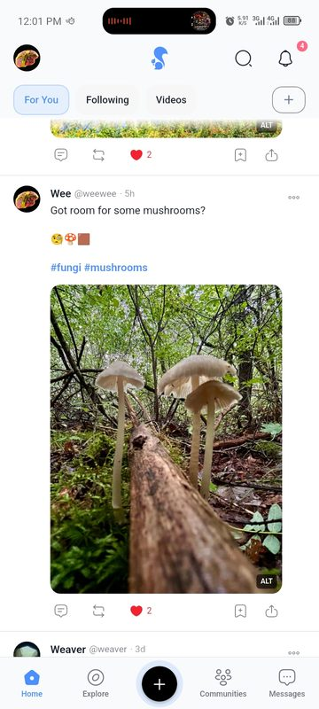 | 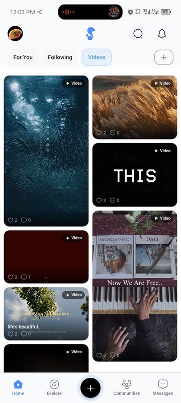 |
| **The feed.** Ranked, not chronological — interests, who you follow, what you have liked, how long you read, and what you have asked to see less of. For You / Following / Videos. | **Videos.** Its own tab, laid out as tiles sized to each clip rather than a uniform grid. |
| 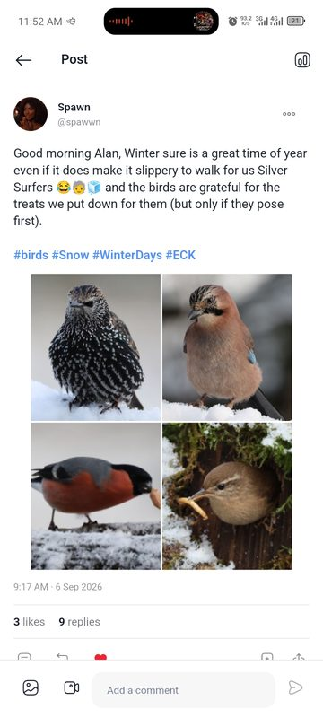 | 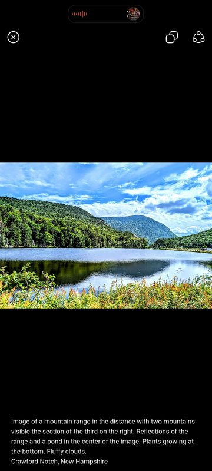 |
| **A post.** Text, hashtags, and up to four images in a grid that adapts to how many there are. | **The media viewer.** Pinch to zoom, swipe between images, and the alt text underneath rather than hidden behind a badge. |

## Conversation

| | |
|:--:|:--:|
| 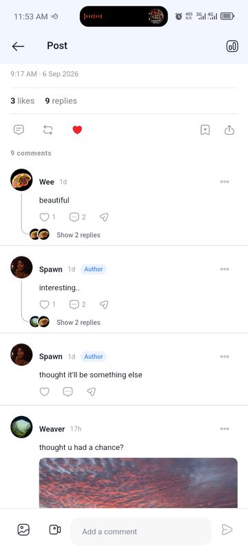 | 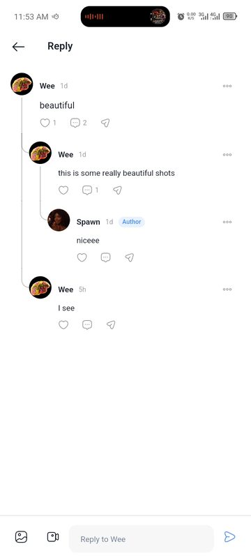 |
| **Comments.** Threaded at real depth with connector rails, and an **Author** badge on replies by the person who wrote the post. | **A reply's own page.** Any comment can be opened on its own, with its ancestors above it, so a deep thread stays readable. |
| 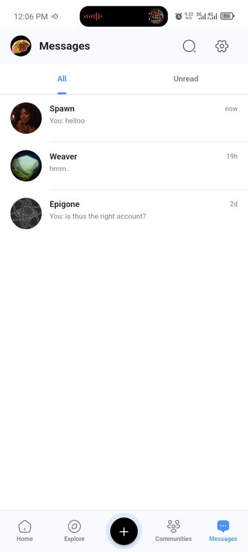 | 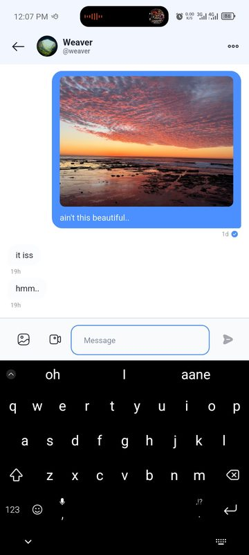 |
| **Messages.** One-to-one, with All and Unread. | **A conversation.** Attachments, read state, and text sealed end to end — [what that does and does not cover](E2EE.md). |

## Finding things

| | |
|:--:|:--:|
| 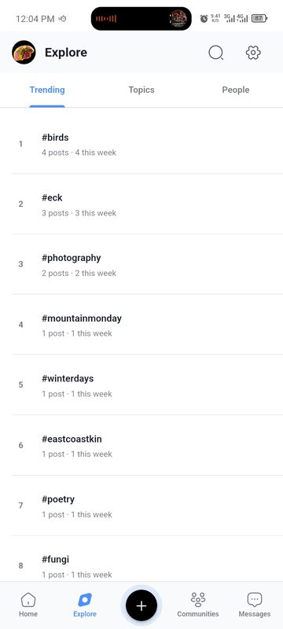 | 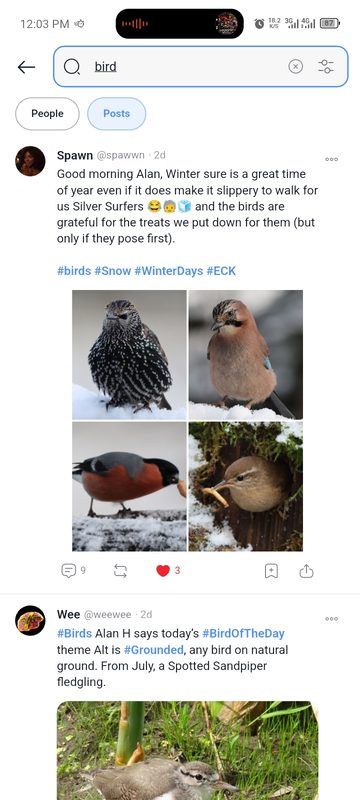 |
| **Explore.** What is actually being used this week — trending tags, topics, and people. | **Search.** People and posts, with filters. |
| 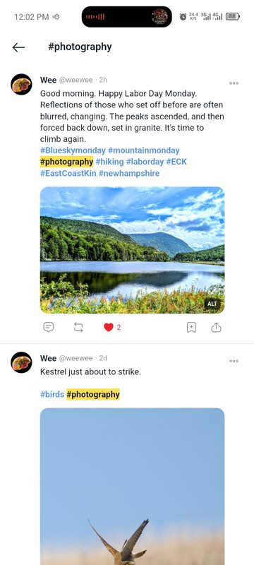 | 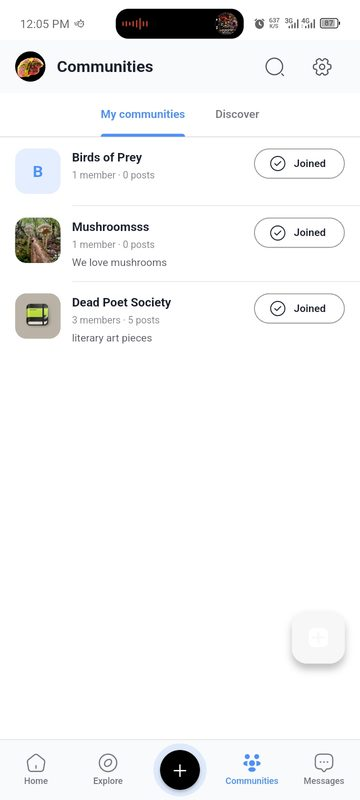 |
| **A hashtag.** Every post carrying it. | **Communities.** Create, join, post, moderate — with roles and bans. |
| 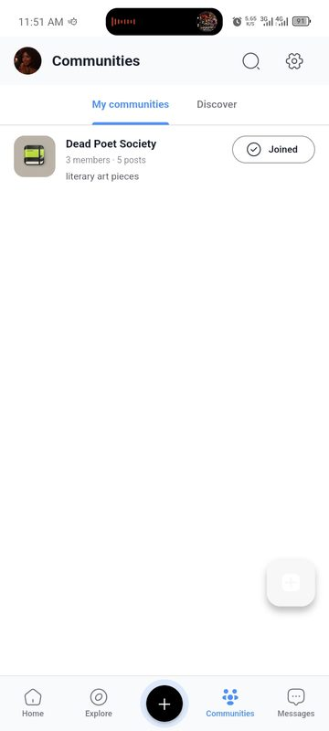 | 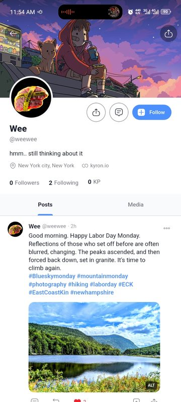 |
| **Discover.** Communities you are not in yet. | **A profile.** Cover, avatar, bio, links, followers, and the author's posts and media. |

## Doing things

| | |
|:--:|:--:|
| 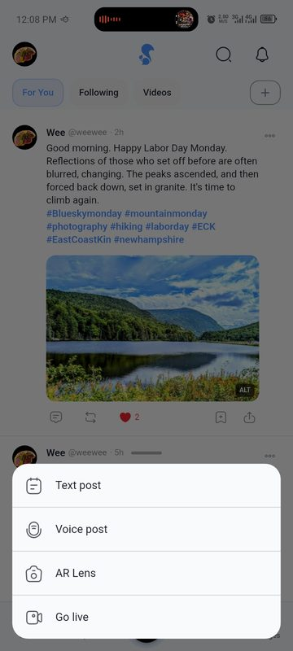 | 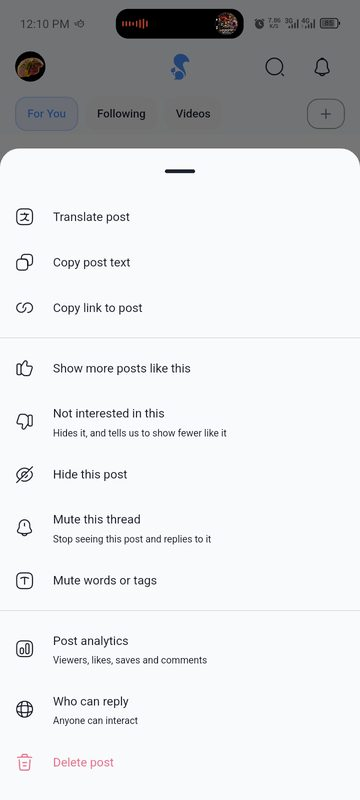 |
| **Composing.** Text, voice, and the two that are not built — AR Lens and Go live open a screen that says so rather than a broken one. | **What you can do with a post.** Every action is a bottom sheet; there are no dropdown menus anywhere in Kyron. |
| 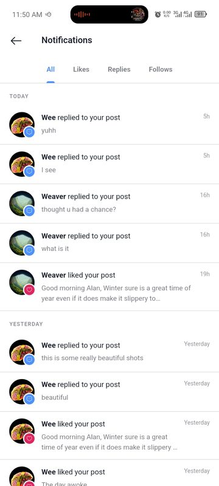 | 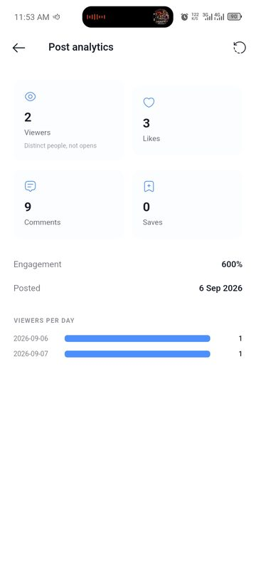 |
| **Notifications.** All, Likes, Replies, Follows — delivered over a socket while the app is open. | **Your own post's reach.** Views, likes, comments and saves, and views per day. Only the author can see it. |
| 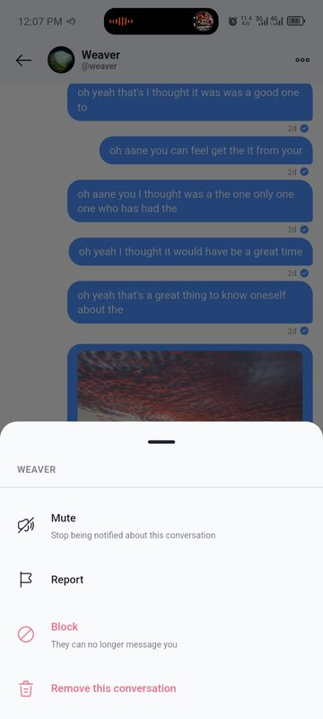 | 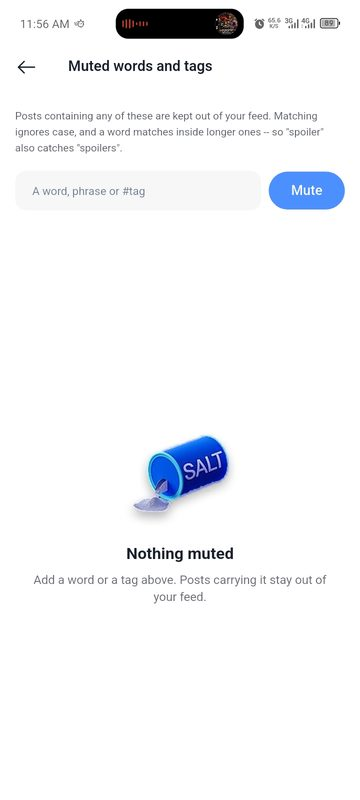 |
| **Conversation actions.** Mute, report, block, remove. | **Muted words.** A word or tag here keeps a post out of your feed, matching inside words too. |

## Account and diagnostics

| | |
|:--:|:--:|
| 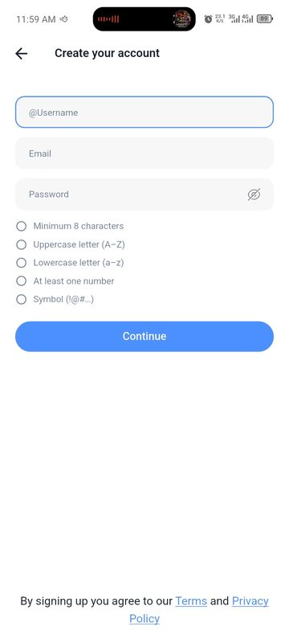 | 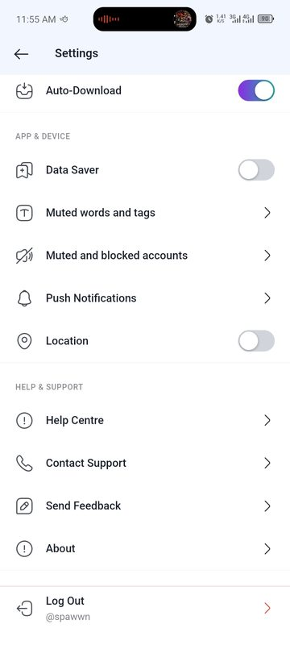 |
| **Signing up.** Password rules shown as you type rather than as an error afterwards. | **Settings.** Privacy, display, downloads, and the rest — every subscreen is real. |
| 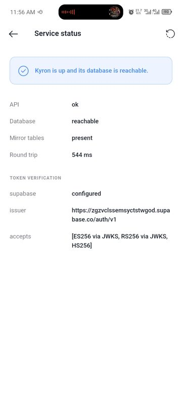 | 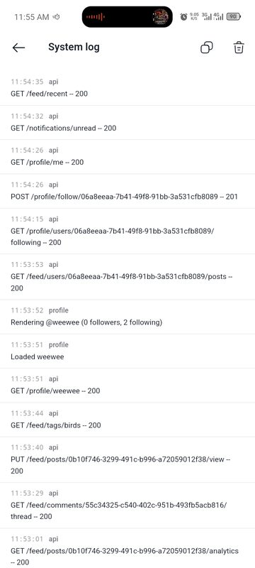 |
| **Service status.** Whether the API, its database and the storage mirror are reachable, and how the deployment verifies tokens — diagnosable from the phone, without log access. | **The system log.** What this install has actually been doing, and the thing an error report attaches. |
| 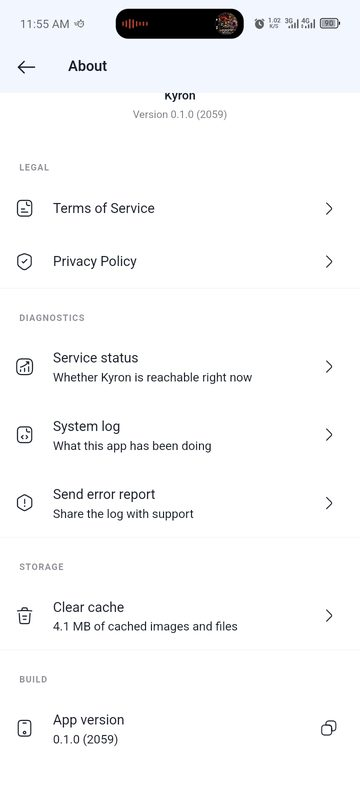 | |
| **About.** The running build, the legal links, and the way in to the diagnostics above. | |

---

## Not shown, because they do not exist

AR lenses and live video are on the create menu and open a "coming soon"
screen. They are listed in [the roadmap](../ROADMAP.md) as not started, and
there is nothing to screenshot.
